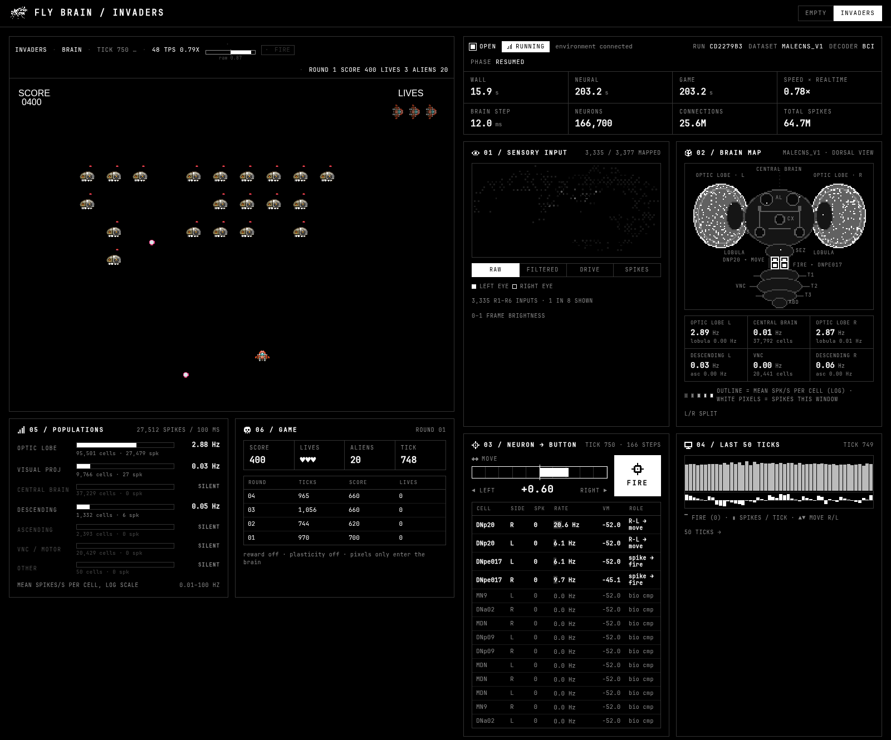

<h1 align="center">FLY BRAIN / INVADERS</h1>
<p align="center">A reconstructed fruit-fly brain plays Space Invaders. Pixels in, spikes out.</p>



## What this is

In 2026 Google Research and Janelia's FlyEM team published the first complete wiring diagram of a male fruit fly's brain and nerve cord, the MaleCNS v1.0 connectome. Every neuron, every synapse. This project loads that wiring, simulates all **166,700 neurons and 25.6 million connections** as spiking cells, and gives the result a joystick.

The game is Space Invaders. The fly sees the screen through its own photoreceptors, the signal ripples through the real wiring, and two descending neurons at the bottom of the brain decide where the ship goes and when it fires. Nothing else touches the controls. No game AI, no scripted aiming, no cheating with alien coordinates.

* [Google Research: a connectomics milestone](https://research.google/blog/a-connectomics-milestone-mapping-the-complete-male-fruit-fly-brain/)
* [The Keyword: mapping the male fruit fly brain](https://blog.google/innovation-and-ai/technology/research/male-fruit-fly-brain-map/)

The neuron model, retina mapping and decoder idea come from the DOOMFLY project, which did the same thing with Doom. Space Invaders is a port of Trung Vo's Phaser 3 game. This is a demo, not a neuroscience result.

## How it works

```
browser                                        python
Phaser canvas ─ 160x120 frame ─ WebSocket ─▶ 3,335 photoreceptors ─▶ 166,700 LIF neurons ─▶ decoder
   ▲                                                                                        │
   └────────────── move ∈ [-1, 1], fire ∈ {0, 1}, plus telemetry for the dashboard ◀────────┘
```

1. **Seeing.** The browser downscales the game canvas and sends it to the brain. The brain samples brightness at the 3,335 positions where the fly's R1–R6 photoreceptors sit, worked out from which lamina cells each receptor connects to in the connectome.
2. **Thinking.** Each photoreceptor injects current into its neuron. Activity spreads through the wiring as spikes, 0.1 ms at a time. Every synapse is kept, with a sign from its predicted neurotransmitter. The kernel is C++ with OpenMP and runs faster than realtime on a laptop.
3. **Acting.** A fixed decoder reads two descending neuron types. DNp20 right-minus-left firing rate moves the ship, a DNpe017 burst fires. A slow running mean is subtracted so the fly steers on changes in what it sees, not on a constant wiring bias. These are engineered mappings, not a claim about what these neurons do in a living fly.
4. **Lockstep.** The game advances one 60 Hz tick only after the brain has integrated the matching 16.7 ms of neural time. Game time equals brain time.

The dashboard shows what the fly sees, a schematic of its nervous system lighting up by region and hemisphere, the decoder cells, the motor output, and the score.

## Run it

You need [uv](https://docs.astral.sh/uv/), Node 20+, and a C++ compiler.

```sh
git clone https://github.com/parazeeknova/fly-invaders fly-invaders && cd fly-invaders
./demo.sh
```

For the real brain, download and prepare the connectome once (about 1 GB, 15 minutes, 8 GB RAM), then run the demo again. It picks the real graph automatically.

```sh
cd brain && uv sync && uv run python -m flybrain.setup && cd ..
./demo.sh
```

Open <http://localhost:5173>. **INVADERS** is the default scene, **EMPTY** shows the brain with a black screen. The newest tab drives the brain; older tabs drop to keyboard mode. With no brain running the game is keyboard controlled.

The brain saves its complete state every minute and on exit, and resumes from it. Weights are fixed, so the fly keeps its state between runs but does not yet learn.

## Layout

| path | contents |
| --- | --- |
| `brain/` | Python: connectome import, graph preparation, LIF kernels, retina sampling, decoder, WebSocket server |
| `web/src/game/` | Phaser scenes, deterministic `step()` environments, frame capture, lockstep bridge |
| `web/src/panels/` | Dashboard panels: retina, brain map, readouts, timeline, populations, rounds |
| `PROTOCOL.md` | Wire protocol between the two halves |

## Next

* Reward-gated plasticity on the mushroom body output synapses, so the fly can learn.
* An LLM observer reading the telemetry and narrating what the fly experiences.

## Credits

MaleCNS v1.0 connectome by Janelia FlyEM and Google Research. Neuron model, retina projection and decoder design from DOOMFLY (MIT). Game from [space-invaders-phaser-3](https://github.com/trungk18/space-invaders-phaser-3) (MIT).
